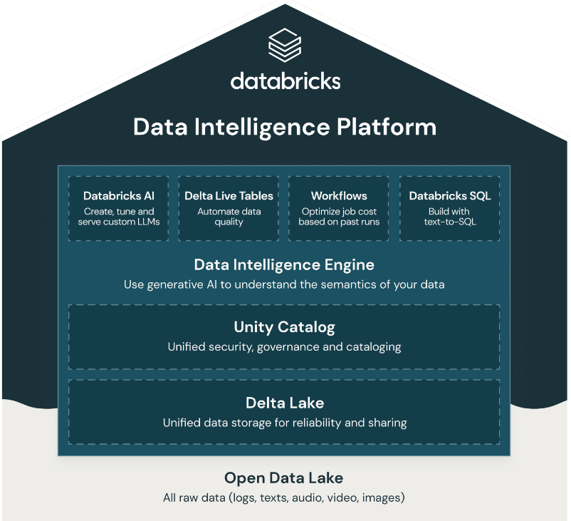

## About Databricks

### About Databricks

- Databricks, founded by the early AMPlab team, joined the community to further develop Spark.
- The organization was founded to deliver a comprehensive analytics platform, streamlining Spark's application in big data processing and analytics.
- Databricks has bridged the gap between academic research and enterprise applications through its managed cloud service and significant contributions to the Spark project.

### Beyond Apache Spark

*Photo copied from [Datanami](https://www.datanami.com)*

### Do You Need Databricks to Work with Spark?

#### Do You Need Databricks to Work with Spark?

#### The answer is NO!

#### Databricks is one of the cloud options to run Apache Spark workload

### Do You Need Databricks to Work with Spark?

- Spark workloads can be run both on the Cloud and on-premise.
    - **Cloud:** Choose any preferred cloud provider, like AWS, GCP, Databricks, or Azure.
    - **On-Premise:** Deploy on YARN, Mesos, or Kubernetes.
    - **Serverless Platforms:** For efficient resource management, consider options like:
        - **AWS:** EMR Serverless or AWS Glue.
        - **GCP:** Dataproc.
        - **Azure:** Azure Synapse.
        - **Databricks:** Databricks analytics platform.



You can download the video by right clicking the link and chose save link as: [Download Video](https://garage-education.s3.amazonaws.com/spark-course/Ch.04-04-About-Databricks.mp4)
