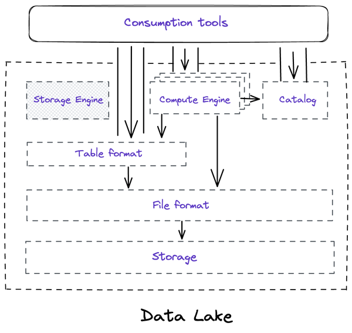
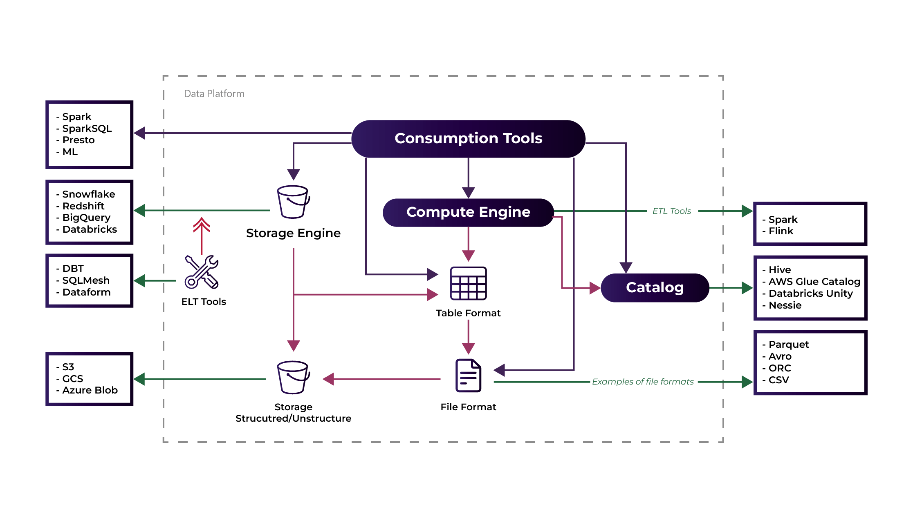

Here's the updated content with the additional photos and captions:

## Apache Spark in Data Platforms

### Technical components in a data lake

*Apache Iceberg: The Definitive Guide: Data Lakehouse Functionality, Performance, and Scalability on the Data Lake, PUBLISHED BY: O'Reilly Media, Inc.*

### Technical components in a data lake



You can download the video by right clicking the link and chose save link as: [Download Video](https://garage-education.s3.amazonaws.com/spark-course/Ch.04-05-Spark-In-The-Data-Platforms.mp4)
