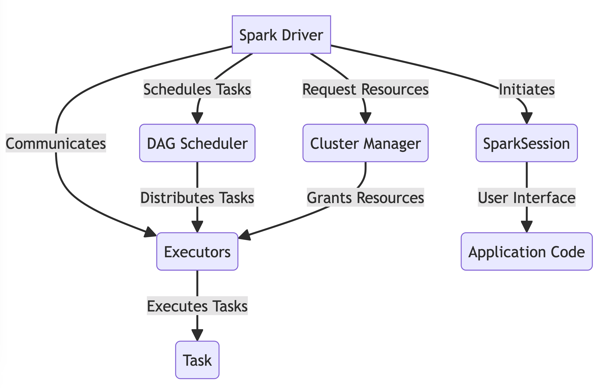

Here's the converted content to Markdown:

## Spark Driver

### Spark Driver

The driver is the process `in the driver seat.`[^1] of your Spark Application.

[^1]: Spark: The Definitive Guide, Chapter 15.

### Spark Driver: Key functions

- It transforms all the Spark operations into DAG computations, schedules them, and distributes their execution as tasks across the Spark executors.
- Controlling the execution of a Spark Application.

### Spark Driver: Key functions

- Acting as a process on a physical machine, responsible for the overall state of the application on the cluster.
- It instantiates the `SparkSession`.
- It requests resources (CPU, memory, etc.) from the cluster manager for Spark’s executors (JVMs).
- Once the resources are allocated, it communicates directly with the executors.

### Spark Driver: Recap



You can download the video by right clicking the link and chose save link as: [Download Video](https://garage-education.s3.amazonaws.com/spark-course/Ch.04-14-Spark-Driver.mp4)
