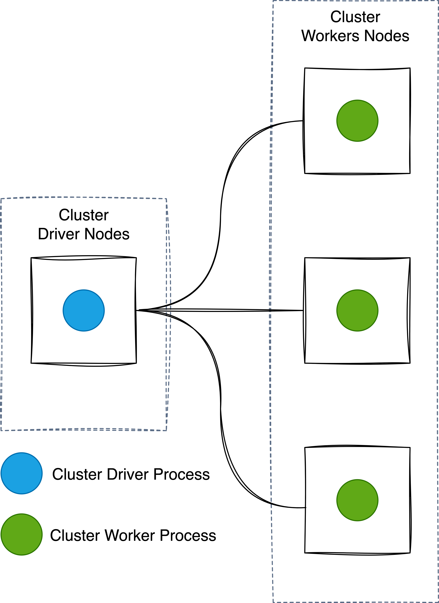

Here's the converted content to Markdown:

## Cluster Manager

### Introduction to Spark Cluster Managers

- The cluster manager allocates resources for Spark applications.
- Supports several managers: Standalone, Hadoop YARN, Apache Mesos, and Kubernetes.

### Role of the Cluster Manager

- The Spark Driver and Executors do not exist in a void, and this is where the cluster manager comes in.
- The cluster manager is important for managing a cluster of machines intended to run Spark Applications.
- Maintains a `driver (or master)` and `worker` nodes, tied to **physical machines**.

### Cluster Manager Components

*Figure 1: A cluster driver and worker (no Spark Application yet).*

### Execution of Spark Applications

- The user requests resources from the cluster manager to initiate Spark applications.
- The user configures the application to specify resources for the driver or only for executors.
- The cluster manager directly manages the machines during the execution of the application.



You can download the video by right clicking the link and chose save link as: [Download Video](https://garage-education.s3.amazonaws.com/spark-course/Ch.04-16-Spark-Cluster-Manager.mp4)
