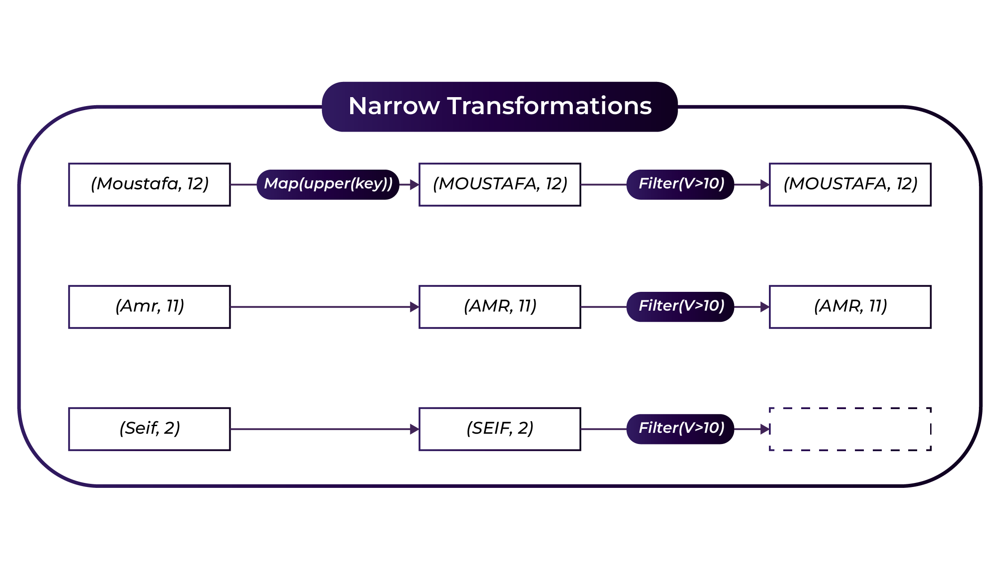
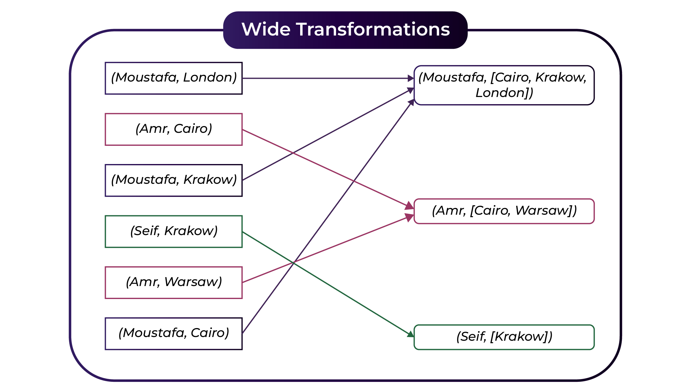

Here's the converted content to Markdown:

## Narrow and Wide Transformations

### Introduction to Spark Transformations

- Transformations create new RDDs from existing ones.
- Spark has two types of transformations: Narrow and Wide.

### What are Narrow Transformations?

- Transformations that do not require data shuffling between partitions.
- Examples: `map()`, `filter()`.
- Data processing is limited to a single partition.

### What are Narrow Transformations?

*Figure 1: Spark Narrow Transformations.*

### Benefits of Narrow Transformations

- Efficient with minimal data movement.
- Best for independent data processing tasks.

### What are Wide Transformations?

- Transformations that involve shuffling data across partitions.
- Examples: `groupBy()`, `reduceByKey()`.

### What are Wide Transformations?

*Figure 2: Spark Wide Transformations.*

### Wide Transformations and Dependencies

- **Wide Dependencies:** Require data from multiple partitions, often involving shuffling.
- **Examples:** `groupBy()`, `orderBy()` - data is combined across partitions, affecting performance.
- **Impact:** These transformations are necessary for operations like counting occurrences across a dataset.

### Implications of Wide Transformations

- Shuffling can be expensive in terms of time and network I/O.
- Essential for aggregation and grouping operations.

### Narrow vs. Wide Dependencies

- **Narrow Dependencies:** A single output partition can be computed from a single input partition without data exchange.
- **Examples:** `filter()`, `contains()` - operate independently on partitions.



You can download the video by right clicking the link and chose save link as: [Download Video](https://garage-education.s3.amazonaws.com/spark-course/Ch.04-21-Transformations-Narrow-Vs-Wide.mp4)
