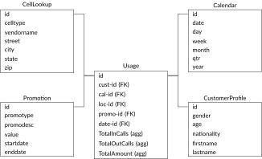

[Ch.02: DWH](../../../../02-dwh) | [DWH Components](../../../03-architecture/) | [Data Modeling](../../10-data-modeling/)

## Video



## Data Modeling

### Data Modeling Objective

-   Explain what data modeling is and its roles?

-   Be aware of its importance.

-   Explore different types of data modeling.

- We target to explain the main components and types, and for more details, it could be found in the appendix videos.
### What is data model?

- The data model
    -   is An abstract model that organizes elements of data.
    
    -   It describes the objects, entities, and data structure properties,
        semantic, and constraint.
    
    -   It formalizes the relationship between entities.
    
    -   It describes how the application (report) API data manipulation.
    
    -   It describes the conceptual design of a business or an application
        with its flow, logic, semantic information (rules), and how things
        are done.
    
    -   It refers to a set of concepts used in defining such as entities,
        attributes, relations, or tables.

- Data model is not

    -   a science.
    
    -   a static design for each organization.
    
    -   a type of database.
    
    -   a new invention which needs to be done for each project.

- Data model is
    
    -   a general concept that leads to build full architecture.
    
    -   an engineering design practices.
    
    -   different based on the use case and the database type.
    
    -   customizable, and we can utilize some of the ready built
        architecture.
    
    -   affecting information reporting performance.

- The data model is

    -   The first part before starting integration with any new source
        system.
    
    -   The connection layer between business requirements and technical
        design.
    
    -   It is also the translation between logical and physical layer.
    
    -   It is unified across all systems and has the same patterns and
        practices.
    
    -   It engaged with any source systems integration from the early
        stages.
    
    -   **This stage output is a data model design document or mapping sheet**

### Why does the data model are important?

Data models are currently affecting software design.

It decides how engineers think about the problem they are solving.

### Data Model Design vs Implementation

-   If you need to build a home, so, how do we design this home?

    -   Determine if the home is one level or multi-level and decide
        main bedrooms and bathrooms for each floor. (User needs)

    -   Hire an architect to put the architecture in more detailed way
        the size for each room, the distribution of the wires, where the
        plumbing fixtures will be placed, etc. (Architecture phase)

    -   Decide the decorations, colors for each room, carpets, etc.

-   What do we do for the implementation?

    -   Hire a contractor to build (implement the design) the home.

    -   This phase implement the design, but it also includes some
        detail related to the real way to build the tools and the
        material (Physical Design).

### Elements of Data Model

**Facts**:   are the measurements/metrics or facts from the business process
    (Telecom industry, measurement would be the count of daily/hourly
    usage per customer). We could consider facts as the source of
    reporting for the business.

**Dimensions**:   provide the context surrounding a business process event. In simple
    terms, they give who, what, where the fact, (Telecom industry, for
    the fact daily usage, dimensions would be customer\_id,
    location\_id).

**Attributes**:   are the various characteristics of the dimension. In the previous
    examples, the attributes can be customer details (from customer\_id
    get the gender, age, nationality, etc.).

### Elements of Dimensional Data Model

**Fact Table**:   is a primary table in a dimensional model.A Fact Table contains
    (Measurements/facts and Foreign key to *dimension table*). It
    located at the center of a star or snowflake schema and surrounded
    by dimensions.

**Dimension table**:   contains dimensions of a fact and business reference data. They are
    joined to fact table via a foreign key. Dimension tables are
    de-normalized tables. It connected to the fact table and located at
    the edges of the star or snowflake schema.

### Example of Data Model

### Elements of Data Model

Dimensional model life cycle:

-   Gathering Requirements (Source Driven, Business/User Driven).

-   Identify granularity of the facts

-   Identify the dimensions

-   Identify the facts

### Dimensions Types

1.  Conformed Dimension.

2.  Degenerate Dimension.

3.  Junk Dimension (Garbage Dimension).

4.  Role-Playing Dimension.

5.  Outrigger Dimension.

6.  Snowflake Dimension.

7.  Shrunken Rollup Dimension.

8.  Swappable Dimension.

9.  Slowly changing Dimension.

10. Fast Changing Dimension (Mini Dimension).

11. Heterogenous Dimensions

12. Multi-valued dimensions

## Dimensional Modeling Further Reading! 🗒️

Data modeling is an essential part of the data warehouse. So, we gave this part our attention in the course and also seeking to provide some further materials to help the interested practitioners to have more details.

We did a lot of searches, and we found one of the best references in this area is **Dimensional Modeling: In a Business Intelligence Environment** and you can download the book for free from  [this link](https://www.redbooks.ibm.com/redbooks/pdfs/sg247138.pdf).

**Note:** We will keep this article updated for all detail for data modeling

Why do we choose this book?

- **Simplicity** the book is easy for reading for anyone who can dig into this field without complication.
- **Practical Examples** contains too many examples which help to give more idea about the topics.
- **Structure** the book is structured in a reasonable manner, which allows you to build the full picture with a quick and logical way with data engineering and data warehouse perspective. 

## Data and Dimensional Modeling Design Further reading
We recommend reading the following chapters as further reading as it gives you more detail about this topic with more examples.
1. *Chapter 3: Data modeling: The organizing structure* from page 47 to page 73.
2. *Chapter 5: Dimensional Model Design Life Cycle* from page 103 to 120

`Assignment: Please write an article explain some parts we missed in the videos or didn't dig in detail, and after reading this part, you released it could be part of our course.`
## Reference Link
- The data model design vs implementation example taken from: https://opentextbc.ca/dbdesign01/chapter/chapter-5-data-modelling/
* * *

## Previous Chapters

[Overview](../../../../../big-data-in-depth/)  | [Ch.01: Intro](../../../../01-introduction) 
