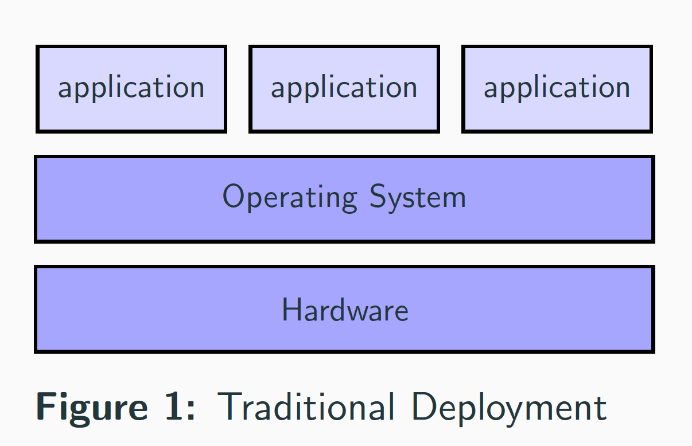
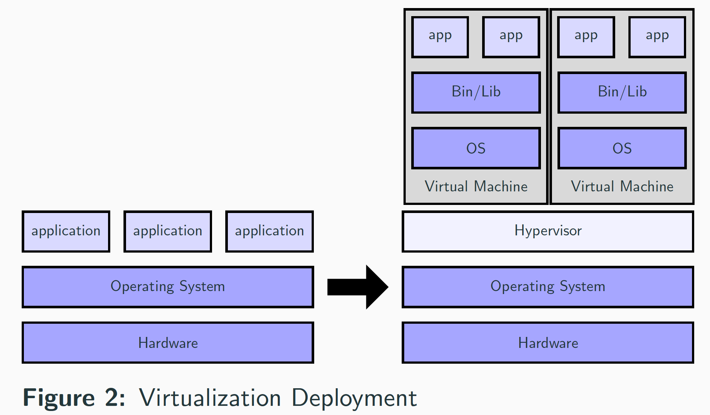
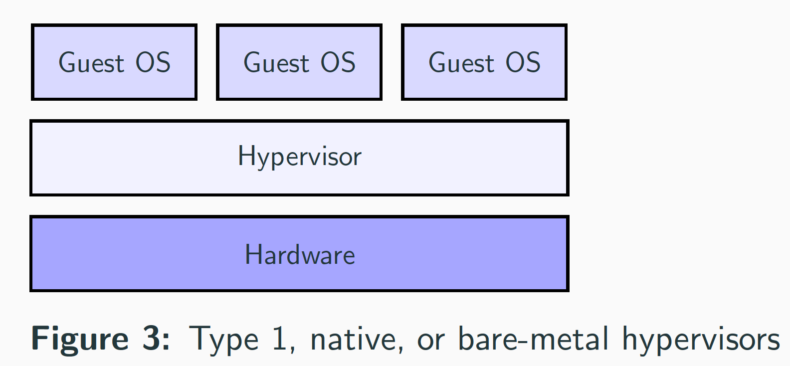
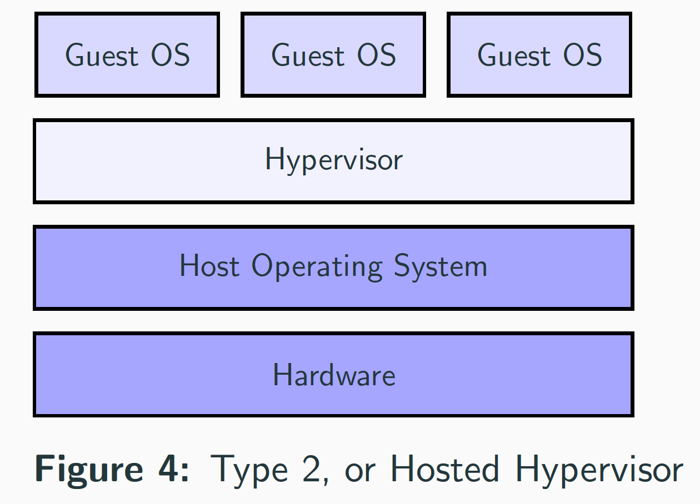
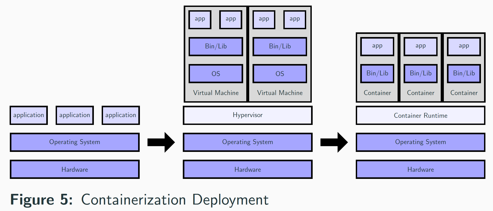
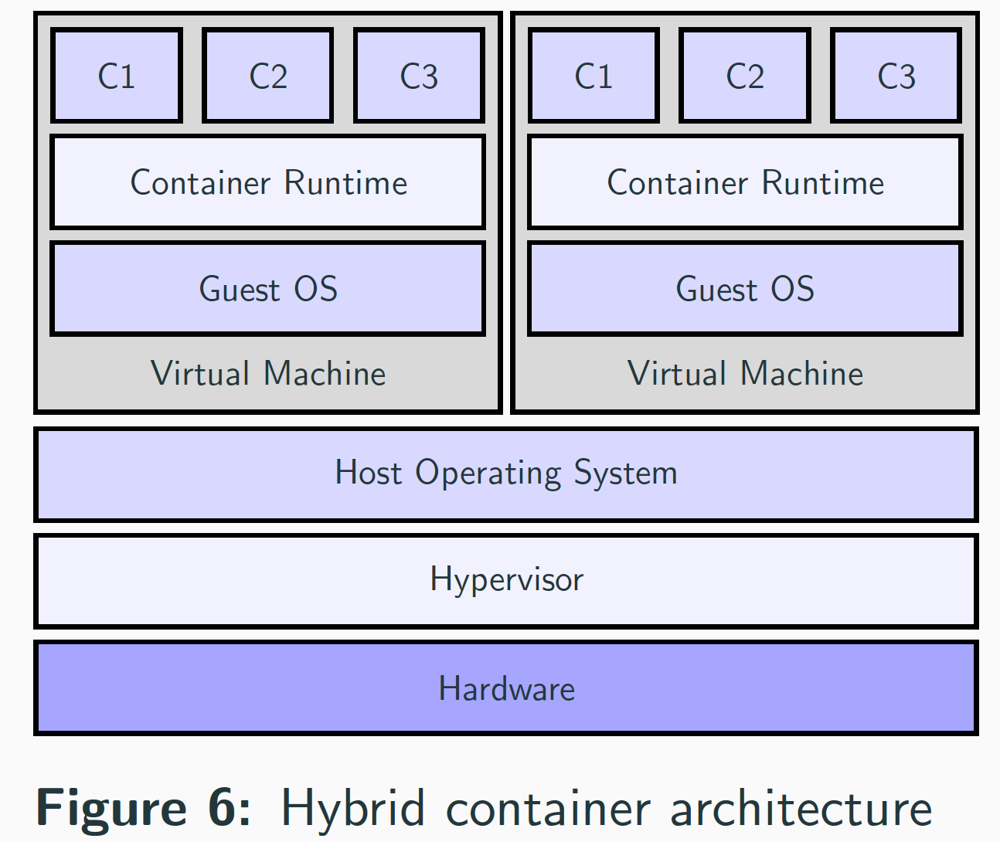

## Lesson Notes

[Containerization Lesson Notes](containerization_notes.pdf)

[Containerization Presentation](containerization_presentation.pdf)

## Video



## Introduction
   
### History of running a software

* Early on, organizations ran applications on physical servers.
* Install or use an existing operating system.
* Install the tools needed by your software.
* Install dependencies of your software.
* Run your software.

### Traditional Deployment

   
### Issues with traditional deployment

* Isolation issue, no way to define resource boundaries for applications in a physical server, and this caused resource allocation issues.
* Scaling issues as resources were underutilized.
* It was expensive for organizations to maintain many physical servers.

## Virtualization

### Virtual Machines! How is virtualization possible?

* Virtualizing hardware produces virtual machines (VMs).
* Virtualization allows you to run multiple VMs on a single physical server. Each VM includes a full copy of an operating system, the application, necessary binaries, and libraries - taking up tens of GBs.
* Virtualization allows more effortless adding and updating of applications that solve the scalability issue.
* Virtualization allows better utilization of resources.
* Virtualization isolates applications between VMs.

### Virtualization Deployment

### Hypervisor

* How is virtualization possible?
    * A hypervisor is computer software, firmware or hardware that creates and runs virtual machines.
    * The hypervisor allows multiple VMs to run on a single machine.
* The hypervisor has 2 types:
    * Type 1 Hypervisor, native, or bare-metal hypervisors.
    > Example: VMware ESX and Citrix Xen servers.
    >     
    * Type 2 Hypervisor, or hosted hypervisors.
    > Type-2: VMware player and VirtualBox.
    > 

## Containerization

### Containers! What is a Container?

* The process of virtualizing the operating system produces containers.
* Container is a virtual operating system.
* A container is an abstraction at the OS layer that packages code and dependencies together as a standardized unit of software.
* Containers take up less space than VMs, boots quickly, and in isolation.
* Containerization eliminates infrastructure wasted resources and utilizes them.

### Containerized Deployment

### OS-level virtualization

#### How is containerization possible?

*  OS-level virtualization refers to an operating system paradigm in which the operating system allows the existence of multiple isolated user-space instances (containers).
* OS-level virtualization solutions are the container engines.
* A container engine is a managed environment for deploying containerized applications.

#### User-space instances have different names
* Containers in \textbf{Docker} and Linux containers \textbf{LXC}.
* VPS in \textbf{OpenVZ}
* Virtual Kernel \textbf{DragonFly BSD}

## Summary and Popular Questions

### Summary

* The word virtualization applies to hardware and operating system.
* Hardware virtualization produces virtual machines.
* Operating system virtualization produces containers.

### Why Containers are more popular?

* Containerization gives us better resource isolation with predictable application performance.
* Containerization gives us better resource utilization with high efficiency and density.
* They are loosely coupled, distributed, elastic, liberated micro-services.
* Environmental consistency across development, testing, and production `"It worked on my machine."`
* Agile application creation and deployment.

### What is hybrid container architecture?

* hybrid container architecture is an architecture combining virtualization on both hardware and OS levels.
* Example: The container engine and associated containers execute on top of a virtual machine.
* Use of a hybrid container architecture is also known as hybrid containerization.

### Do windows have native containers?

* You can have native windows containers but not Linux native containers yet.
* Microsoft's native hypervisor solution is Hyper-V\@.
* Using Hyper-V Microsoft supports running VMs natively on Windows, for example, Ubuntu on Windows (WSL).
* Microsoft is working on the OS-level virtualization solution to run Linux native containers.

## References

1. [Virtualization via containers](https://insights.sei.cmu.edu/sei_blog/2017/09/virtualization-via-containers.html)
1. [OS-level virtualization](https://en.wikipedia.org/wiki/OS-level_virtualization)
1. [Hyper-V](https://en.wikipedia.org/wiki/Hyper-V)
1. [What is a container?](https://www.docker.com/resources/what-container)
1. [What is Kubernetes?](https://kubernetes.io/docs/concepts/overview/what-is-kubernetes/)
1. [Prep Windows for containers](https://docs.microsoft.com/en-us/virtualization/windowscontainers/quick-start/set-up-environment?tabs=Windows-10-Client)
